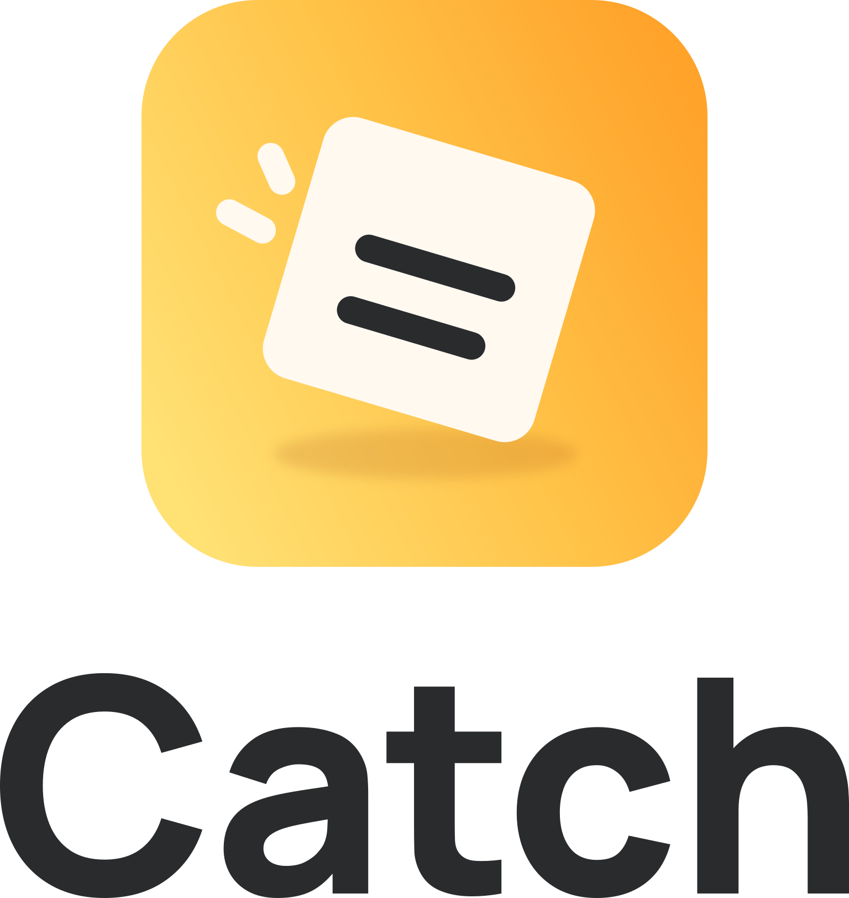
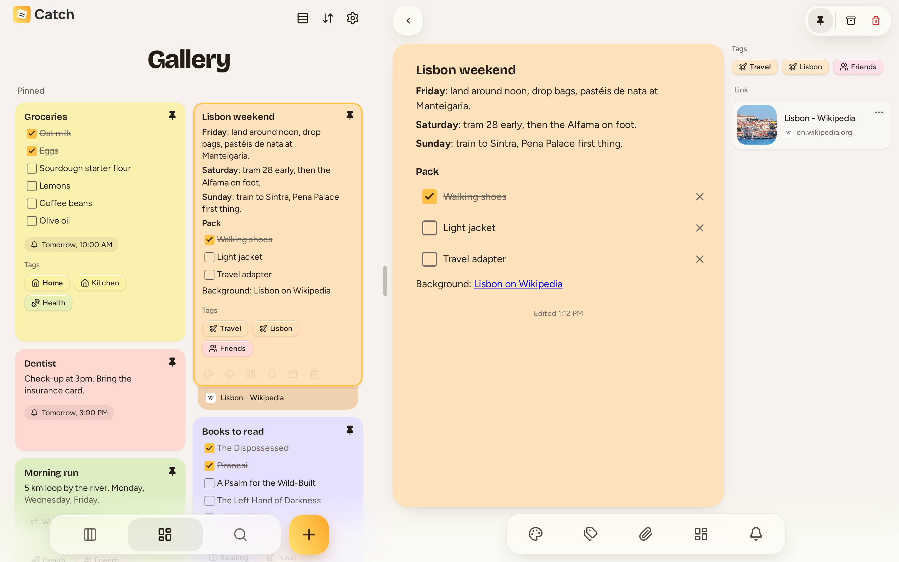
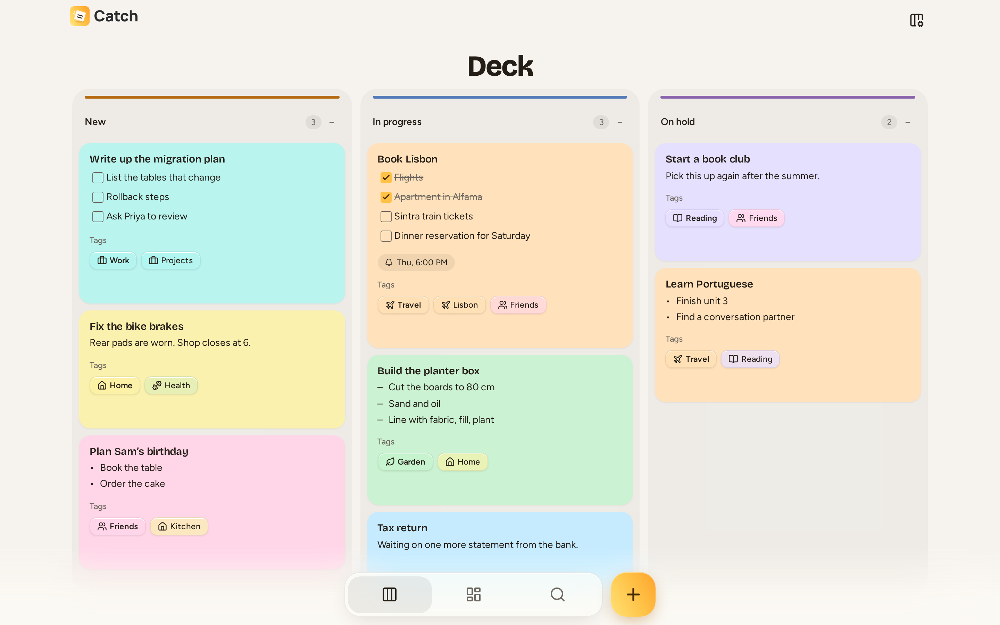
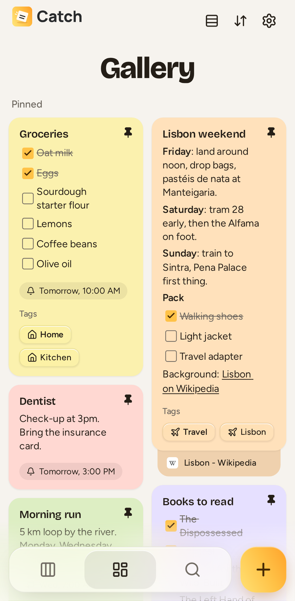
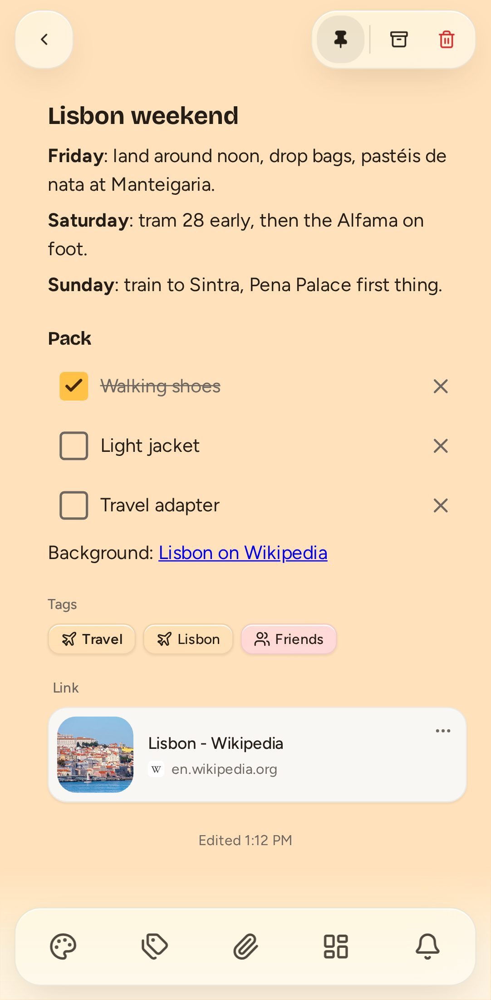
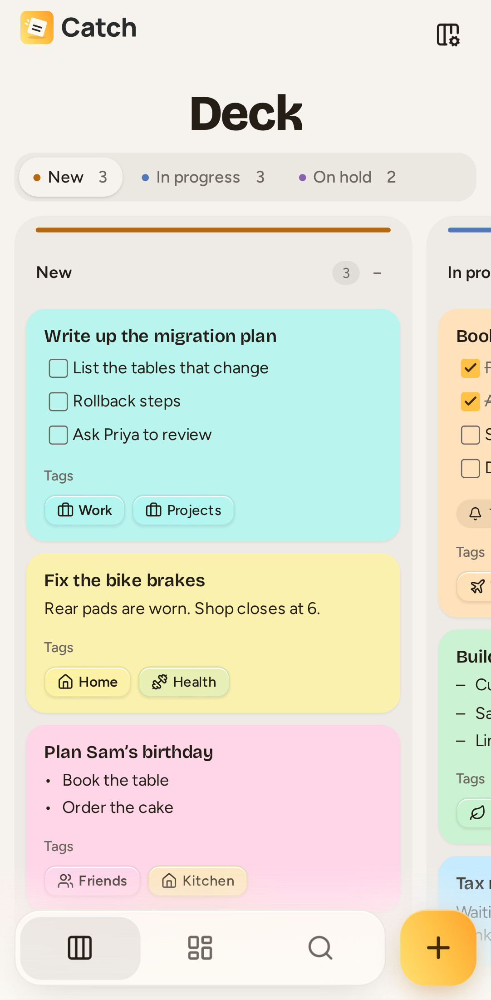

<h1 align="center">
  <picture>
    <source media="(prefers-color-scheme: dark)" srcset="apps/web/public/wordmark/catch-lockup-stacked-stable-light.svg" />
    
  </picture>
</h1>

Catch is a notes app in the spirit of Google Keep that you host yourself. Your notes live on
a server you control, and they keep working on your phone or laptop when you are offline.

It runs in any modern browser, installs as an app from the browser (PWA), and has a native
Android app.

  
  

  
  &nbsp;
  
  &nbsp;
  

## What it does

- **Notes that are quick to write.** Rich text, checklists, colors, pinning, an archive and
  a trash you can restore from.
- **Works offline.** Notes are kept on the device. Changes made without a connection are
  sent when it comes back.
- **Tags and search.** Nested tags, and search with filters for tags and colors.
- **Reminders.** One-off or repeating, delivered as notifications in the browser and as
  alarms in the Android app.
- **Attachments.** Images, video, audio and other files inside notes.
- **Link previews.** A link in a note shows the page's title and picture.
- **A deck for notes in progress.** Give a note a status and follow it on a board.
- **Import from Google Keep.** Bring your notes over from a Google Takeout export.
- **Share to Catch on Android.** Send text, links and files from other apps into a note.
- **Several people on one server.** The first account is the admin, who invites everyone
  else. Each person sees only their own notes.
- **Backups built in.** Admins back up and restore the whole server from Settings, by hand
  or on a daily schedule.

## Get Catch

Catch has no hosted service: you need a Catch server, either your own or one somebody runs
for you.

- **In a browser:** open your server's address and sign in. Your browser can install it as
  an app from there.
- **On Android:** download the APK from the
  [latest release](https://github.com/iiloni/catch/releases/latest), install it and enter
  your server's address on first launch. Later versions are offered in Settings > Update.

Every version is listed with its changes on the
[releases page](https://github.com/iiloni/catch/releases). Versions marked *preview* come
out ahead of stable ones and install as a separate Catch Preview app.

## Run your own server

Catch runs with Docker Compose on any machine that can stay on, such as a home server or a
small VPS. Setting it up takes a few commands and a web address with HTTPS.

**[Deployment guide](DEPLOYMENT.md)** covers installation, settings, inviting people,
backups and updates.

## Work on Catch

Catch is a TypeScript project: a React web app, a Node server and an Android app built from
the same code. The whole development environment starts with one command in Docker.

**[Development guide](DEVELOPMENT.md)** covers setup, tests, the Android app and how
changes get merged.

> [!NOTE]
> Catch is not accepting external contributions at the moment. You are welcome to read the
> code, run it and fork it under the license below.

## AI development notice

Catch is developed primarily with AI coding tools. The maintainer develops
both the frontend and backend design and directs agents through implementation. Code quality is
validated through manual and automated testing and supplemental AI review. As with all
self-hosted projects, you are encouraged to maintain regular backups of your Catch service.

## More documentation

| For | Read |
| --- | --- |
| Server admins | [Deployment](DEPLOYMENT.md), [Server backups](docs/backups.md), [Releases and channels](docs/releases.md) |
| Contributors | [Development](DEVELOPMENT.md), [Architecture and conventions](AGENTS.md), [Design decisions](docs/decisions), [Pull requests and CI](docs/ci.md) |

## License

[MIT](LICENSE)
